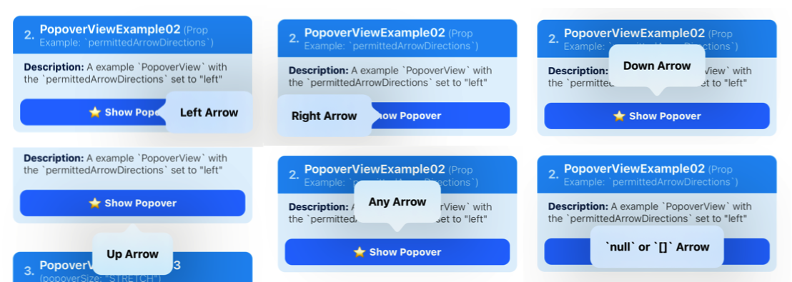
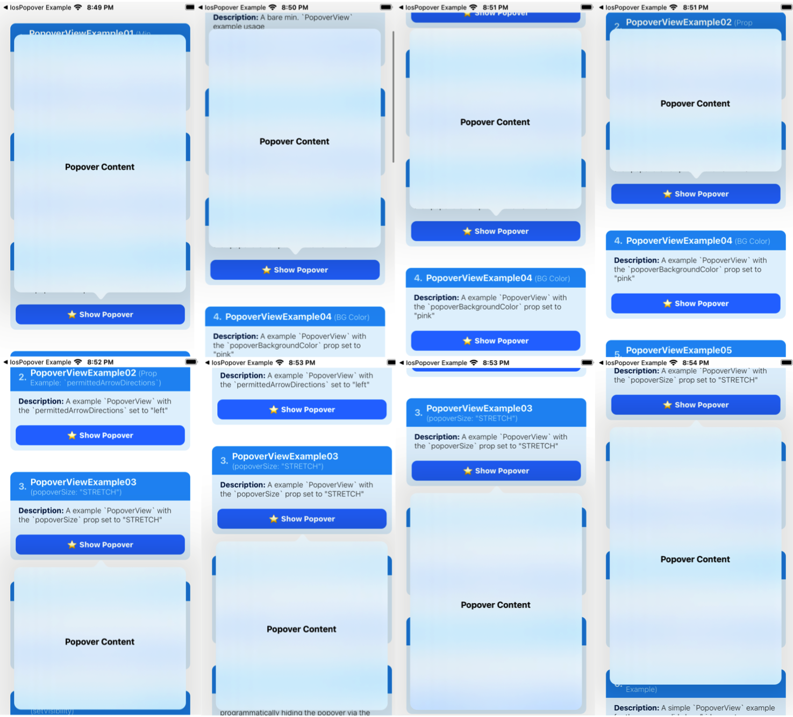
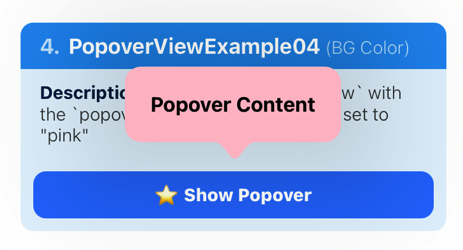
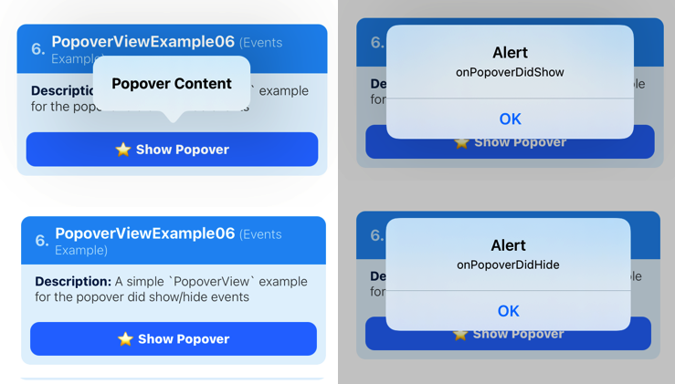

# react-native-ios-popover

A react native wrapper component to use the native iOS popover by wrapping a react native view inside a `UIViewController` and presenting it.

## 1. Installation

```sh
# install via npm
npm install react-native-ios-popover

# or install via yarn
yarn add react-native-ios-popover

# then run pod install (uses auto-linking)
cd ios && pod install
```

<br>

### 1.1 Installation Notes
If you encounter any errors/bugs while using this library, or want a particular feature implemented, please create an issue!

#### 1.1.1 Xcode Build Error (Swift)
This library is written in Swift. If you are having trouble building your app after installing this library, try adding an empty swift file:
1. Open up your `ios/project.xcworkspace` project
2. On the project navigator panel (located on the right side of Xcode), right click on your project group (or another folder/group i.e the blue or yellow icons) and select the "*New File...*" option
3. In the popup sheet, select "Swift" as the template and then click the "*Next*" button
4. A "*Save As*" popup sheet should appear and then click "*Create*" (you can rename the file first if you want to)
5. If Xcode asks you to create a "*Objective-C Bridging Header*" choose *"Create Objective-C Bridging Header"*

<br>

#### 1.1.2 Cocoapods Static Libraries Error
If you encounter the following error when running `pod install`:

```
[!] The following Swift pods cannot yet be integrated as static libraries:

The Swift pod `react-native-ios-popover` depends upon `React-Core`, which does not define modules. To opt into those targets generating module maps (which is necessary to import them from Swift when building as static libraries), you may set `use_modular_headers!` globally in your Podfile, or specify `:modular_headers => true` for particular dependencies.
```

<br>

Then try following these steps:
1. Open up your project's `ios/podfile` configuration
2. Under `target 'ProjectName' do` block, find the `'React-Core'` pod, and append the following snippet to the end of the line: `, :modular_headers => true`
3. It should now look something similar to this: `pod 'React-Core', :path => '../node_modules/react-native/', :modular_headers => true`
4. Try running `pod install` again.

<br>

## 2. Usage

Please check out the examples section or the examples directory for more on how to use it.

```jsx
import { PopoverView } from "react-native-ios-popover";

function PopoverViewExample() {
  const popoverRef = useRef();

  return (
    <PopoverView
      ref={popoverRef}
      renderPopoverContent={() => (
        <View style={{padding: 20}}>
          <Text>
            {'Popover Content'}
          </Text>
        </View>
      )}
    >
      <TouchableOpacity onPress={() => {
        popoverRef.current.toggleVisibility();
      }}>
        <Text>
          {'Toggle Popover Visibility'}
        </Text>
      </TouchableOpacity>
    </PopoverView>
  );
};
```

### 2.2 `PopoverView` Section Links
Here is an overview of all the documentation and examples for the `PopoverView` component.

| Description | Section Link |
|-------------|--------------|
|             |              |

<br>

## 3. Documentation
### 3.1 Modules/Components
#### `PopoverView` Props

| Prop Name                         | Type                                                         | Description                                                  |
| --------------------------------- | ------------------------------------------------------------ | ------------------------------------------------------------ |
| `renderPopoverContent`            | **Required**: `Function` -> `Element`                        | The elements to show in the popover. This prop accepts a function that returns an element. The element returned from this function will be shown in the popover. |
| `popoverSize`                     | **Optional**: `String` or  `Object: {width: number, height: number}` <br>**Default**: `INHERIT` | Controls the size the of the popover.<br><br>This prop accepts either  a `String` value ( i.e. a  `PopoverSize` enum item e.g. `INHERIT`, `STRETCH` sring) or a "size" object (i.e. an object with a `height` and/or `width` property).<br/><br/>If you provide a size object (e.g. `{width: 100, height: 100}`) then that object will be used for setting the size of the popover. |
| `popoverBackgroundColor`          | **Optional**: `String`<br>**Default**: `transparent`         | Sets the background color of the popover.                    |
| `permittedArrowDirections`        | **Optional**: `[String]`<br/>**Default**: `["any"]`          | Sets the arrow directions that you allow for the popover. <br><br>Accept an array of 0 or more string values, i.e. an array of `ArrowDirections` enum items (e.g. `up`, `down`, etc.)<br/><br/>Note If you pass in an empty array, then there will be no arrow shown. |
| `lazyPopover`                     | **Optional**: `Bool`<br/>**Default**: `true`                 | Controls whether or not the popover content is always mounted. If set to `true` the popover content will only be mounted while the popover is visible.<br/><br/>Set this to `false` to prevent the popover from closing. |
| `popoverShouldDismiss`            | **Optional**: `Bool`<br/>**Default**: `true`                 | Controls whether or not a tap outside the popover will dismiss it. |
| `popoverCanOverlapSourceViewRect` | **Optional**: `Bool`<br/>**Default**: `false`                | Controls whether the popover can overlap its source view. If set to `false` the popover will avoid covering up the source view. |
<br>

##### `PopoverView` Events

| Event Name                     | Description                                                  |
| ------------------------------ | ------------------------------------------------------------ |
| `onPopoverDidShow`             | Event that gets called **after** the popover is shown, i.e. this event is invoked after the popover entrance animation is finished. |
| `onPopoverDidHide`             | Event that gets called **after** the popover is hidden, i.e. this event is invoked after the popover exit animation is finished. |
| `onPopoverWillShow`            | Event that gets called **before** the popover is shown, i.e. this event is immediently invoked when the popover is about to become visible. |
| `onPopoverWillHide`            | Event that gets called **before** the popover is hidden, i.e. this event is immediently invoked when the popover is about to become hidden. |
| `onPopoverDidHideViaTap`       | Event that gets called **before** the popover is hidden due to a tap outside the popover's content, i.e. this event is immediently invoked when the popover is about to become hidden. |
| `onPopoverWillHideViaTap`      | Event that gets called **after** the popover is hidden due to a tap outside the popover's content, i.e. this event is invoked after the popover exit animation is finished. |
| `onPopoverDidAttemptToDismiss` | This event is invoked when the `popoverShouldDismiss` prop is set to `false`, and a tap outside the popover's content is initiated to dismiss the popover. |

<br>

##### `PopoverView` Functions

| Function Name                         | Description                                                  |
| ------------------------------------- | ------------------------------------------------------------ |
| **async** `setVisibility(boolean)`    | A function that you can call to set whether or not the popover is shown or hidden.<br>This function returns a promise that gets resolved when the popover is successfully shown or hidden. This function throws an error if the popover is already hidden or shown. |
| **async** `toggleVisibility()`        | A function that you can call to toggle the popover's visibility.<br/>This function returns a promise that gets resolved when the popover is successfully shown or hidden. |
| **async** `getVisibility()` -> `Bool` | A function to query whether or not the popover is visible. Returrns a promise that resolves to a boolean value. |
<br>

### 3.2 Enum Values
#### 3.2.1 `PopoverSize` Enum

This enum is used to for the `PopoverView`'s `popoverSize` prop. Use this enum to control the size of the popover.

- Import the enum like this: `import { PopoverSize } from "react-native-ios-popover";`

- And use it like this: `{ popoverSize: PopoverSize.STRETCH }`

- Or you can directly pass a string like this: `{ popoverSize: 'STRETCH' }`

  

| Value     | Description                                                  |
| --------- | ------------------------------------------------------------ |
| `INHERIT` | The default value. Specifies that the popover's size should match the view you return from `PopoverView.renderPopoverContent` prop. It will automatically resize/scale the popover to fit the screen. |
| `STRETCH` | Specifies that we want the popover to be as big as possible, i.e. the popover should to stretch and fill up the screen. |

<br>

#### 3.2.2 `ArrowDirections` Enum

This enum is used to for the `PopoverView`'s `permittedArrowDirections` prop. This enum corresponds to the `UIPopoverArrowDirection` swift struct, check out the [apple docs](https://developer.apple.com/documentation/uikit/uipopoverarrowdirection) for more info.

- Import the enum like this: `import { ArrowDirections  } from "react-native-ios-popover";`
- And use it like this: `{ permittedArrowDirections: [ArrowDirections.up] }`
- Or you can directly pass a string like this: `{ permittedArrowDirections: ['up'] }`

| Value     | Description                                                  |
| --------- | ------------------------------------------------------------ |
| `up`      | An arrow that points upward. The popover will appear at the bottom with the arrow pointing up. |
| `down`    | An arrow that points downward. The popover will appear at the top with the arrow pointing down. |
| `left`    | An arrow that points toward the left. The popover will appear at the right with the arrow pointing left. |
| `right`   | An arrow that points toward the right. The popover will appear at the left with the arrow pointing right. |
| `any`     | An arrow that points in any direction.                       |
| `unknown` | The status of the arrow is currently unknown.                |
<br>

## 4 Examples
### 4.1 `PopoverView` Examples
#### 4.1.1 `PopoverView` Example #1

A bare minimum example showing how to present a popover via the `setVisibility` function.

<br>

```jsx
function PopoverViewExample01() {
  const popoverRef = useRef();

  return (
    <PopoverView
      // get/store a ref to the popover component
      ref={popoverRef}
      // a function that returns the content to show
      // inside the popover
      renderPopoverContent={() => (
        <View style={{padding: 20}}>
          <Text>
            {'Popover Content'}
          </Text>
        </View>
      )}
    >
      <TouchableOpacity onPress={() => {
        // show the popover when the button is pressed
        // alt. you can call `toggleVisibility` to show/hide the popover
        popoverRef.current.setVisibility(true);
      }}>
        <Text>
          {'Show Popover'}
        </Text>
      </TouchableOpacity>
    </PopoverView>
  );
};
```


<br><br>

#### 4.1.2 `PopoverView` Example #2

A example `PopoverView` for the `permittedArrowDirections` prop. 

* This prop accepts an array of `ArrowDirections` string values (e.g: 'up', 'down', etc). You can also pass in an empty array or null to specify that the popover should not have an arrow.
* The popover position and sizing will automatically adapt based on the `permittedArrowDirections`.

<br>

```jsx
function PopoverViewExample02() {
  const popoverRef = useRef();
  
  return(
    <PopoverView
      ref={popoverRef}
      // the allowed direction of the popover arrow.
      // accepts an array of `ArrowDirections` values,
      // e.g. "up", "down", etc.
      permittedArrowDirections={["left"]}
      renderPopoverContent={() => (
        <View style={{padding: 20}}>
          <Text>
            {'Left Arrow'}
          </Text>
        </View>
      )}
      >
      <TouchableOpacity onPress={() => {
        popoverRef.current.setVisibility(true);
      }}>
        <Text>
          {'Show Popover'}
        </Text>
      </TouchableOpacity>
    </PopoverView>
  );
};
```



<br><br>

#### 4.1.3 `PopoverView` Example #3

A example `PopoverView` with the `popoverSize` prop set to "STRETCH". 

* By default, the `popoverSize` prop is set to `INHERIT` which means the size of the popover is determined by the size of the popover content.
* However, if you set the prop  to `STRETCH`, the popover will be sized to be as big as possible based on the `permittedArrowDirections` prop, its position on screen, etc. 

<br>

```jsx
function PopoverViewExample03() {
  const popoverRef = useRef();

  return(
    <PopoverView
      ref={popoverRef}
      // set the `popoverSize` prop to `STRETCH` to make the
      // popover as big as possible.
      popoverSize={'STRETCH'}
      // You also have to set `popoverCanOverlapSourceViewRect`
      // prop to false to prevent the popover from covering up
      // the popover source view.
      popoverCanOverlapSourceViewRect={false}
      permittedArrowDirections={["up", "down"]}
      // the style of the root popover content view must be set
      // to `{flex: 1}` so that it'll stretch to the size of the
      // popover.
      renderPopoverContent={() => (
        <View style={{flex: 1, alignItems: 'center', justifyContent: 'center'}}>
          <Text>
            {'Popover Content'}
          </Text>
        </View>
      )}
    >
      <TouchableOpacity onPress={() => {
        popoverRef.current.setVisibility(true);
      }}>
        <Text>
          {'Show Popover'}
        </Text>
      </TouchableOpacity>
    </PopoverView>
  );
};
```



<br><br>

#### 4.1.4 `PopoverView` Example #4

A example `PopoverView` with the `popoverBackgroundColor` prop set to "pink". By default, the `PopoverView` has a transparent background with a blur effect.

<br>

```jsx
function PopoverViewExample04(props) {
  const popoverRef = useRef();

  return (
    <PopoverView
      ref={popoverRef}
      // pass in a valid color value
      popoverBackgroundColor={'pink'}
      renderPopoverContent={() => (
        <View style={{padding: 20}}>
          <Text>
            {'Popover Content'}
          </Text>
        </View>
      )}
    >
      <TouchableOpacity onPress={() => {
        popoverRef.current.setVisibility(true);
      }}>
        <Text>
          {'Show Popover'}
        </Text>
      </TouchableOpacity>
    </PopoverView>
  );
};
```



<br><br>

#### 4.1.5 `PopoverView` Example #5

A example `PopoverView` for programmatically hiding the popover via the `setVisibility` function.

* The `setVisibility(bool)` function will throw an error if it's already visible or hidden.

<br>

```jsx
function PopoverViewExample05(props) {
  const popoverRef = useRef();

  return (
    <PopoverView
      ref={popoverRef}
      onPopoverDidHideViaTap={() => alert('onPopoverDidHideViaTap')}
      renderPopoverContent={() => (
        <View style={{padding: 20}}>
          <TouchableOpacity onPress={() => {
            // hide the popover
            popoverRef.current.setVisibility(false);
          }}>
            <Text>
              {'Dismiss Popover'}
            </Text>
          </TouchableOpacity>
        </View>
      )}
    >
      <TouchableOpacity onPress={() => {
        // toggle popover visibility
        popoverRef.current.toggleVisibility();
      }}>
        <Text>
          {'Toggle Popover'}
        </Text>
      </TouchableOpacity>
    </PopoverView>
  );
};
```


<br><br>

#### 4.1.6 `PopoverView` Example #6

A simple `PopoverView` example for the popover did show/hide events.

<br>

```jsx
function PopoverViewExample06(props) {
  const popoverRef = useRef();

  return(
    <PopoverView
      ref={popoverRef}
      // popover events
      onPopoverDidHide={() => alert('onPopoverDidHide')}
      onPopoverDidShow={() => alert('onPopoverDidShow')}
      renderPopoverContent={() => (
        <View style={{padding: 20}}>
          <Text style={styles.popoverText}>
            {'Popover Content'}
          </Text>
        </View>
      )}
    >
      <TouchableOpacity onPress={() => {
        popoverRef.current.setVisibility();
      }}>
        <Text>
          {'Toggle Popover'}
        </Text>
      </TouchableOpacity>
    </PopoverView>
  );
};
```



<br><br>

#### 4.1.7 `PopoverView` Example #7

A example `PopoverView` that has a switch that toggles the `popoverShouldDismiss` prop.

* The `onPopoverDidAttemptToDismiss` prop is set to `true` by default. This prop controls whether or not the popover should dismiss when there's a tap gesture outside the popover.
* So setting the `onPopoverDidAttemptToDismiss` to `false` will prevent the popover from dismissing via a tap outside the popover.

<br>

```jsx
function PopoverViewExample07(props) {
  const popoverRef = useRef();
  
  const [isEnabled, setIsEnabled] = useState(false);
  // toggle `popoverShouldDismiss`
  const toggleSwitch = () => setIsEnabled(previousState => !previousState);

  return(
    <PopoverView
      ref={popoverRef}
      popoverShouldDismiss={isEnabled}
      onPopoverDidAttemptToDismiss={() => alert('onPopoverDidAttemptToDismiss')}
      renderPopoverContent={() => (
        <View>
          <Text>
            {'popoverShouldDismiss'}
          </Text>
          <Switch
            onValueChange={toggleSwitch}
            value={isEnabled}
          />
        </View>
      )}
    >
      <TouchableOpacity onPress={() => {
        popoverRef.current.setVisibility(true);
      }}>
        <Text>
          {'Show Popover'}
        </Text>
      </TouchableOpacity>
    </PopoverView>
  );
};
```


<br><br>

#### 4.1.8 `PopoverView` Example #8

A example `PopoverView` for the `toggleVisibility` function.

<br>

```jsx
function PopoverViewExample08(props) {
  const popoverRef = useRef();

  return(
    <PopoverView
      ref={popoverRef}
      popoverShouldDismiss={false}
      renderPopoverContent={() => (
        <View style={{padding: 20}}>
          <Text>
            {'Popover Content'}
          </Text>
        </View>
      )}
    >
      <TouchableOpacity onPress={() => {
        // toggle the popover visibility
        popoverRef.current.toggleVisibility();
      }}>
        <Text>
          {'Toggle Popover'}
        </Text>
      </TouchableOpacity>
    </PopoverView>
  );
};
```


<br><br>

## License
MIT

<br>

## Links
* I'm [@DominicGo](https://twitter.com/GoDominic) on twitter if you have any questions ✨
* Other libraries: [react-native-ios-modal](https://github.com/dominicstop/react-native-ios-modal), [react-native-ios-context-menu](https://github.com/dominicstop/react-native-ios-context-menu)
* This library was generated/made using [@react-native-community/bob](https://github.com/callstack/react-native-builder-bob)